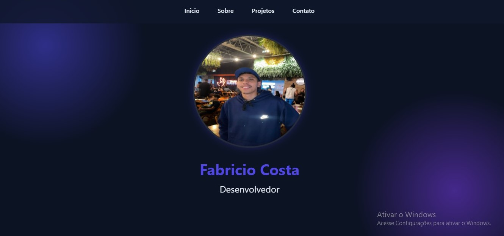

<h1 align="center" style="font-weight: bold;">Portifolio💻</h1>

 <a href="#tech">Technologies</a>

    <b>Portifolio</b>

     <a href="https://costafabricio.github.io/Portifolio/">📱 Visit this Project</a>

<h2 id="layout">🎨 Layout</h2>

    

<h2 id="technologies">💻 Technologies</h2>

- list of all technologies you used
- HTML
- CSS

